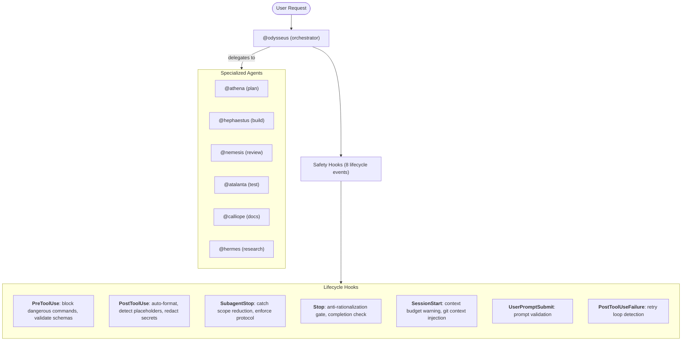

# ClaudeAgents

[](https://github.com/xsyetopz/ClaudeAgents/actions/workflows/ci.yml)
[](LICENSE)

**7 agents, 11 skills, 8 hooks.** One plans, one codes, one reviews, one tests -- you talk.

```bash
# Bootstrap (registers marketplace, installs user-level extras, then installs plugin)
git clone https://github.com/xsyetopz/ClaudeAgents && cd ClaudeAgents
./install.sh --pro    # or --max for opus planning/review agents
```

---

## Why ClaudeAgents

Claude Code is powerful out of the box. ClaudeAgents adds:

- **Specialized agents** that know their role -- an architect won't write code, a reviewer won't fix bugs
- **Safety hooks** that catch placeholders, secrets, scope reduction, and sloppy AI prose automatically
- **Anti-rationalization gates** that prevent Claude from rationalizing incomplete work
- **Tier-based models** so you control cost: Haiku for tests, Sonnet for code, Opus for architecture

---

## Architecture



---

## Plugin Management

```bash
claude plugin install cca@claude-agents   # install (done by bootstrap)
claude plugin update cca@claude-agents    # update to latest
claude plugin uninstall cca@claude-agents # remove
claude plugin list                        # list installed
```

---

## Agents

| Who             | What                             | pro      | max      |
| --------------- | -------------------------------- | -------- | -------- |
| **@athena**     | Plans, designs, architects       | sonnet   | opus[1m] |
| **@hephaestus** | Writes code, fixes bugs          | sonnet   | sonnet   |
| **@nemesis**    | Reviews code, audits security    | sonnet   | opus[1m] |
| **@atalanta**   | Runs tests, finds root causes    | haiku    | haiku    |
| **@calliope**   | Writes docs (markdown only)      | haiku    | haiku    |
| **@hermes**     | Explores codebases, traces flows | sonnet   | sonnet   |
| **@odysseus**   | Coordinates multi-step tasks     | opusplan | opusplan |

**`--pro`** = Sonnet everywhere (Haiku for tests/docs). **`--max`** = Opus[1m] for @athena, @nemesis; opusplan for @odysseus.

---

## Skills

| What it does                    | Command           |
| ------------------------------- | ----------------- |
| Code review                     | `/cca:review`     |
| Remove AI slop                  | `/cca:desloppify` |
| Commits, branches, PRs          | `/cca:ship`       |
| Present options + tradeoffs     | `/cca:decide`     |
| Security audit (OWASP)          | `/cca:security`   |
| Test strategy + coverage        | `/cca:test`       |
| Docs: READMEs, ADRs, changelogs | `/cca:docs`       |
| Performance optimization        | `/cca:perf`       |
| Error handling patterns         | `/cca:errors`     |
| Session handoff                 | `/cca:handoff`    |
| Code style detection            | `/cca:style`      |

---

## Safety Rails

**8/8 hook lifecycle events covered.** All automatic.

| Hook                 | When              | What it does                                             |
| -------------------- | ----------------- | -------------------------------------------------------- |
| `pre-secrets`        | Before any tool   | Blocks .env reads, auth header leaks, force-push to main |
| `pre-bash`           | Before shell      | Blocks dangerous commands, DNS exfil, blanket git add    |
| `pre-schema`         | Before any tool   | Validates file paths and content                         |
| `post-write`         | After write/edit  | Auto-formats, catches placeholders and comment slop      |
| `post-bash`          | After shell       | Scrubs secrets and PII from output                       |
| `post-failure`       | After tool error  | Detects retry loops, suggests alternatives               |
| `user-prompt-submit` | User sends prompt | Git context injection                                    |
| `subagent-scan`      | Agent stop        | Catches stubs, silent scope reduction                    |
| `stop-scan`          | Session end       | Anti-rationalization gate, completion check              |
| `session-budget`     | Session start     | Warns when config files exceed line budgets              |

Plus: LSP error check prompt after every file change, scope reduction and collaboration protocol prompts on every agent stop.

---

## Install

```bash
# Bootstrap: registers marketplace, installs user-level extras, installs plugin
git clone https://github.com/xsyetopz/ClaudeAgents && cd ClaudeAgents
./install.sh --pro         # sonnet agents (haiku for atalanta/calliope)
./install.sh --max         # opus[1m] for athena/nemesis
./install.sh --skip-rtk    # skip RTK token-savings tool
```

---

## Enterprise HTTP Hooks

Forward all hook events to a central DLP/audit server.

```bash
export CCA_HTTP_HOOK_URL="https://dlp.internal/hooks"
export CCA_HTTP_HOOK_TOKEN="Bearer ..."
export CCA_HTTP_HOOK_FAIL_CLOSED=1
```

## Audit Logging

Enable JSON-line audit logging for all hooks:

```bash
export CCA_HOOK_LOG_DIR="/var/log/cca"
```

Writes to `$CCA_HOOK_LOG_DIR/cca-hooks.jsonl`:

```json
{"ts":"2026-03-17T12:00:00Z","event":"PreToolUse","tool":"Bash","action":"blocked","reason":"rm -rf pattern","hook":"pre-bash.mjs"}
```

---

## Development

```bash
make lint      # shellcheck + jsonlint
make test      # node --test (72 tests)
make build     # build plugin
make validate  # lint + test + build
```

---

## Uninstall

```bash
./uninstall.sh --global              # removes plugin, user-level files, cleans settings
./uninstall.sh /path/to/project      # removes project-level files
```

---

## Requirements

Claude Code >= 2.1.75, Node.js >= 18, jq (optional).

---

## License

MIT
