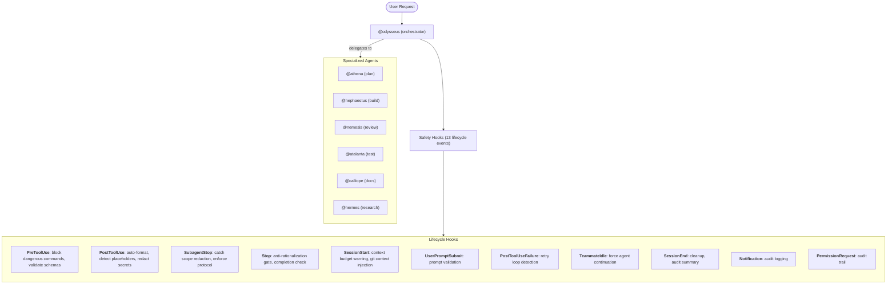

# ClaudeAgents

[](https://github.com/xsyetopz/ClaudeAgents/actions/workflows/ci.yml)
[](LICENSE)

**7 agents, 10 skills, 13 hooks.** One plans, one codes, one reviews, one tests -- you talk.

```bash
# One command
bash <(curl -fsSL https://raw.githubusercontent.com/xsyetopz/ClaudeAgents/master/install.sh)

# Or via plugin
claude plugin install cca
```

---

## Why ClaudeAgents

Claude Code is powerful out of the box. ClaudeAgents adds:

- **Specialized agents** that know their role -- an architect won't write code, a reviewer won't fix bugs
- **Safety hooks** that catch placeholders, secrets, scope reduction, and sloppy AI prose automatically
- **Anti-rationalization gates** that prevent Claude from rationalizing incomplete work
- **Tier-based models** so you control cost: Haiku for tests, Sonnet for code, Opus for architecture
- **Agent team workflows** for end-to-end feature development, debugging, and review

---

## Architecture



---

## Marketplace

Manage the plugin via the CLI:

```bash
claude plugin install cca           # install from marketplace
claude plugin update cca            # update to latest version
claude plugin remove cca            # remove
claude plugin list                  # list installed plugins
claude plugin validate ./dist/...   # validate a local build
```

---

## Agents

| Who | What | pro | max | enterprise |
|-----|------|-----|-----|------------|
| **@athena** | Plans, designs, architects | sonnet | opus | opus |
| **@hephaestus** | Writes code, fixes bugs | sonnet | sonnet | sonnet |
| **@nemesis** | Reviews code, audits security | sonnet | opus | opus |
| **@atalanta** | Runs tests, finds root causes | haiku | haiku | haiku |
| **@calliope** | Writes docs (markdown only) | haiku | haiku | haiku |
| **@hermes** | Explores codebases, traces flows | sonnet | sonnet | sonnet |
| **@odysseus** | Coordinates multi-step tasks | sonnet | opus | opus |

**`--pro`** = Sonnet everywhere (Haiku for tests/docs). **`--max`** = Opus for @athena, @nemesis, @odysseus. **`--enterprise`** = max + audit logs, DLP, compliance.

---

## Skills

| What it does | Plugin | Manual |
|---|---|---|
| Code review | `/cca:review-code` | `/cca-review-code` |
| Remove AI slop | `/cca:desloppify` | `/cca-desloppify` |
| Commits, branches, PRs | `/cca:ship` | `/cca-ship` |
| Present options + tradeoffs | `/cca:decide` | `/cca-decide` |
| Security audit (OWASP) | `/cca:audit-security` | `/cca-audit-security` |
| Test strategy + coverage | `/cca:test-patterns` | `/cca-test-patterns` |
| Docs: READMEs, ADRs, changelogs | `/cca:document` | `/cca-document` |
| Performance optimization | `/cca:optimize` | `/cca-optimize` |
| Error handling patterns | `/cca:handle-errors` | `/cca-handle-errors` |
| Session handoff | `/cca:session-export` | `/cca-session-export` |

---

## Team Workflows

Pre-built multi-agent pipelines:

| Command | Pipeline |
|---------|----------|
| `/team-review` | @hermes explores -> @nemesis reviews -> @atalanta tests |
| `/team-feature` | @athena plans -> @hephaestus builds -> @nemesis reviews -> @atalanta tests |
| `/team-debug` | @hermes investigates -> @hephaestus fixes -> @atalanta verifies |
| `/team-refactor` | @athena designs -> @hephaestus refactors -> @nemesis reviews |
| `/team-ship` | @nemesis reviews -> @atalanta tests -> /cca:ship |

---

## Safety Rails

**13/13 hook lifecycle events covered.** All automatic.

| Hook | When | What it does |
|------|------|-------------|
| `pre-secrets` | Before any tool | Blocks .env reads, auth header leaks, force-push to main |
| `pre-bash` | Before shell | Blocks dangerous commands, DNS exfil, blanket git add |
| `pre-schema` | Before any tool | Validates file paths and content |
| `post-write` | After write/edit | Auto-formats, catches placeholders and comment slop |
| `post-bash` | After shell | Scrubs secrets and PII from output |
| `post-failure` | After tool error | Detects retry loops, suggests alternatives |
| `user-prompt-submit` | User sends prompt | Git context injection |
| `subagent-scan` | Agent stop | Catches stubs, silent scope reduction |
| `stop-scan` | Session end | Anti-rationalization gate, completion check |
| `teammate-idle` | Agent idle | Prevents premature idle in team workflows |
| `session-budget` | Session start | Warns when config files exceed line budgets |
| `notification` | Notifications | Audit logging |
| `permission-request` | Permission dialog | Audit trail |

Plus: LSP error check prompt after every file change, scope reduction and collaboration protocol prompts on every agent stop.

---

## Install

```bash
./install.sh /path/to/project --pro        # sonnet (haiku for atalanta/calliope)
./install.sh /path/to/project --max        # opus for athena/nemesis/odysseus
./install.sh /path/to/project --enterprise # max + audit logs, DLP, compliance
./install.sh /path/to/project --max --zen-mode  # composable zen constraints
./install.sh --global --pro                # ~/.claude/
```

---

## Enterprise HTTP Hooks

Forward all hook events to a central DLP/audit server.

```bash
export CCA_HTTP_HOOK_URL="https://dlp.internal/hooks"
export CCA_HTTP_HOOK_TOKEN="Bearer ..."
export CCA_HTTP_HOOK_FAIL_CLOSED=1
```

## Audit Logging

Enable JSON-line audit logging for all hooks:

```bash
export CCA_HOOK_LOG_DIR="/var/log/cca"
```

Writes to `$CCA_HOOK_LOG_DIR/cca-hooks.jsonl`:

```json
{"ts":"2026-03-17T12:00:00Z","event":"PreToolUse","tool":"Bash","action":"blocked","reason":"rm -rf pattern","hook":"pre-bash.py"}
```

---

## Development

```bash
make lint      # shellcheck + ruff + jsonlint
make test      # pytest (65 tests)
make build     # build plugin
make validate  # lint + test + build
```

---

## Uninstall

```bash
claude plugin uninstall cca          # plugin
./uninstall.sh --global              # manual global
./uninstall.sh /path/to/project      # manual project
```

---

## Requirements

Claude Code >= 2.1.75, Python 3.9+, jq (optional).

---

## License

MIT
