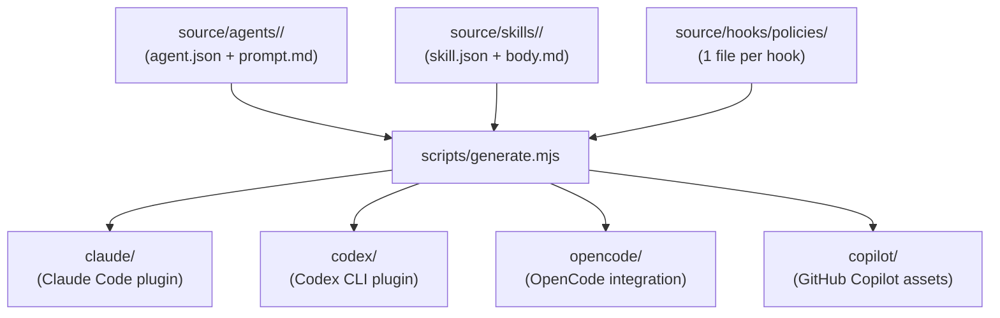

# Onboarding Guide

Walk a new user through openagentsbtw: what it is, how it works, and how to use it effectively.

## What openagentsbtw Is

openagentsbtw is a multi-platform agent toolkit. It generates deterministic agents, skills, and hooks for Claude Code, Codex CLI, OpenCode, and GitHub Copilot from a single canonical source under `source/`.

One source of truth, four platform targets. Edit once, regenerate, and every platform gets correct artifacts.

## Architecture



## The 7 Agents

Each agent is a specialist. Route work to the right one:

| Agent          | Role                                     | When to use                                   |
| -------------- | ---------------------------------------- | --------------------------------------------- |
| **athena**     | Architecture, planning, sequencing       | Before non-trivial multi-file implementation  |
| **hephaestus** | Implementation, bug fixes, refactors     | When the plan is clear and code needs writing |
| **nemesis**    | Review, security, risk finding           | After implementation, before shipping         |
| **atalanta**   | Test execution, failure diagnosis        | When tests fail or need writing               |
| **calliope**   | Documentation, changelogs                | After implementation is stable                |
| **hermes**     | Exploration, tracing, evidence gathering | When you need to understand before changing   |
| **odysseus**   | Multi-step coordination                  | When work spans several agents or phases      |

## The Workflow

**Research -> Plan -> Execute -> Review**

This is the default workflow. Not every task needs all phases -- small fixes can skip straight to Execute. But for non-trivial work:

1. **Research** (`hermes`) -- map the territory, gather evidence
2. **Plan** (`athena`) -- design the approach, identify risks
3. **Execute** (`hephaestus`) -- write the code
4. **Review** (`nemesis`) -- check for regressions, security, quality
5. **Close out** -- verify, document, and hand over cleanly

## Platform-Specific Usage

### Claude Code

Route to agents by name: `@athena`, `@hephaestus`, `@nemesis`, etc.

Available skills (invoke with `/cca:<name>`):
- `/cca:explore` -- codebase exploration
- `/cca:review` -- code review
- `/cca:test` -- test execution
- `/cca:debug` -- structured debugging
- `/cca:git-workflow` -- git workflow
- `/cca:document` -- documentation standards
- `/cca:deslop` -- remove AI writing patterns
- `/cca:design-polish` -- frontend and UI refinement
- `/cca:decide` -- decision protocol for tradeoffs
- `/cca:onboard` -- this guide

### Codex CLI

Use wrapper commands for role-shaped routing:

```bash
oabtw-codex explore "<target>"     # hermes
oabtw-codex plan "<goal>"          # athena
oabtw-codex implement "<task>"     # hephaestus
oabtw-codex review "<scope>"       # nemesis
oabtw-codex test "<scope>"         # atalanta
oabtw-codex document "<task>"      # calliope
oabtw-codex validate "<scope>"     # atalanta (broader)
oabtw-codex design-polish "<ui>"   # UI/frontend refinement
oabtw-codex resume --last          # resume previous session
```

Multi-worker: `oabtw-codex-peer batch` or `oabtw-codex-peer tmux`.

### OpenCode

Same role split. Default templates ship role prompts and shared skills. Use native continuity: `opencode --continue`, `/sessions`, `/compact`.

### GitHub Copilot

Phase prompts live in `.github/prompts/`. Route through: research, plan, implement, review, test, document, orchestrate.

## Shared Surfaces

These optional tools work across all four platforms:

| Tool               | What it does                                     | Check availability             |
| ------------------ | ------------------------------------------------ | ------------------------------ |
| **ctx7**           | External library/API doc lookups                 | `which ctx7`                   |
| **RTK**            | Rewrites dangerous shell commands to safer forms | `which rtk` + `RTK.md` present |
| **Playwright CLI** | Browser automation for debugging                 | `which playwright-cli`         |
| **DeepWiki**       | Indexed GitHub repo exploration                  | Configured via MCP             |

## Safety Hooks

openagentsbtw installs safety hooks that run automatically:

- **pre-bash guard** -- blocks broad `rm -rf`, blanket `git add .`, DNS exfiltration
- **post-bash redact** -- warns on secret/PII leaks in command output
- **post-write scan** -- catches placeholder code before it ships
- **RTK enforcement** -- rewrites dangerous commands when policy is active
- **failure circuit breaker** -- stops retry loops after repeated failures
- **completion gating** -- rejects explanation-only completions on execution routes

These are guardrails, not walls. They catch common mistakes but are not a security boundary.

## Quick Reference

| I want to...               | Do this                                            |
| -------------------------- | -------------------------------------------------- |
| Understand a codebase      | `@hermes` / `oabtw-codex explore`                  |
| Plan an implementation     | `@athena` / `oabtw-codex plan`                     |
| Write code                 | `@hephaestus` / `oabtw-codex implement`            |
| Review changes             | `@nemesis` / `oabtw-codex review`                  |
| Run and fix tests          | `@atalanta` / `oabtw-codex test`                   |
| Write docs                 | `@calliope` / `oabtw-codex document`               |
| Coordinate multi-step work | `@odysseus` / `oabtw-codex orchestrate`            |
| Clean up AI-sounding text  | `/cca:deslop` / `oabtw-codex deslop`               |
| Polish AI-looking UI       | `/cca:design-polish` / `oabtw-codex design-polish` |
| Make a technical decision  | `/cca:decide`                                      |
| Git workflow rules         | `/cca:git-workflow`                                |
| Change your plan preset    | `./config.sh --claude-plan max-20`                 |

## Further Reading

- `docs/architecture.md` -- source layout and workflow reference
- `CONTRIBUTING.md` -- how to contribute to this repo
- `SECURITY.md` -- security model and sandboxing
