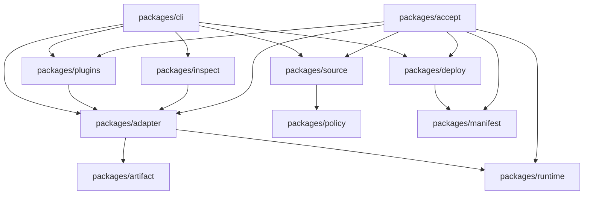
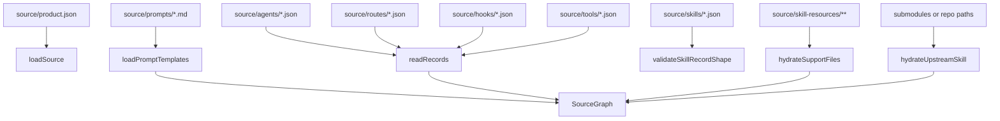
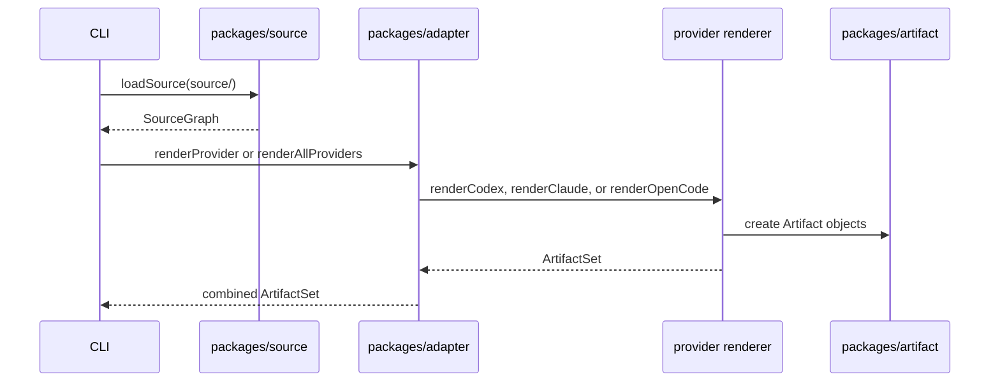
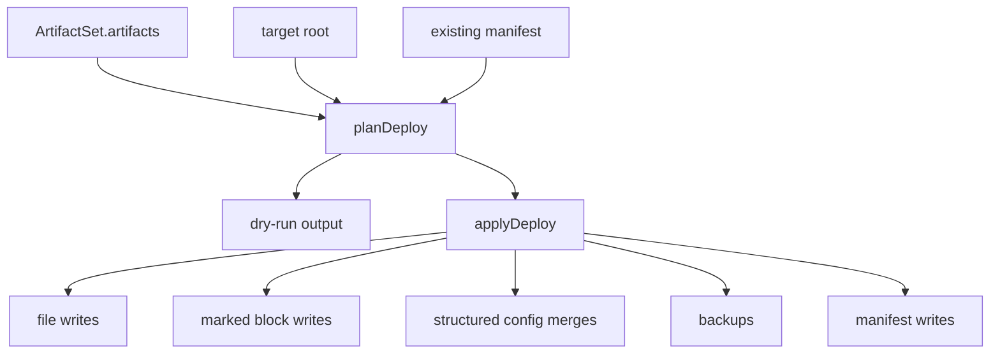
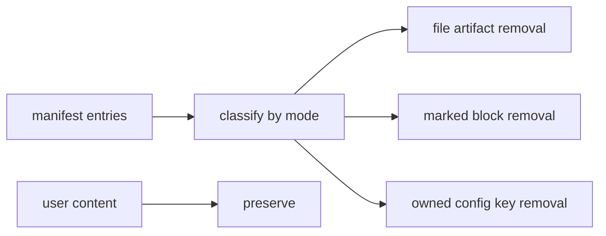

# Source, Render, Deploy Contract

This specification defines the source graph, renderer output, artifact metadata,
deploy planning, apply behavior, manifest ownership, uninstall behavior, and
inspection boundary.

## Package Ownership



The CLI MUST orchestrate these packages. It MUST NOT become the owner of source
loading, rendering, artifact metadata, deploy mutation, manifest semantics, hook
policy, plugin sync, or inspection logic.

## Source Records

`packages/source` owns the in-memory OAL source graph.

The source graph consists of:

```ts
interface OalSource extends ProductSource {
  agents: AgentRecord[];
  skills: SkillRecord[];
  routes: RouteRecord[];
  hooks: HookRecord[];
  tools: ToolRecord[];
}
```

Every record MUST have a stable `id`. Provider-bound records MUST list provider
support explicitly. A renderer MUST ignore a provider-bound record when the
target provider is not listed.

### Product Source

`ProductSource` MUST define:

- `version`
- product identity `{ name: "OpenAgentLayer", shortName: "OAL" }`
- optional caveman output mode
- prompt contracts
- prompt templates loaded from `source/prompts`

Product source is the only place for global prompt contract text. Provider
renderers MAY format that text for native output, but MUST NOT author divergent
copies.

### Agent Records

`AgentRecord` describes a provider-rendered agent:

- `id`: stable source id
- `name`: display name
- `providers`: provider allowlist
- `role`: agent purpose
- `triggers`: route or task hints
- `nonGoals`: explicit exclusions
- `tools`: requested tools
- `skills`: skill ids
- `routes`: route ids
- `models`: provider model map
- `prompt`: source-backed prompt body

Renderers MUST use provider model plans to resolve final model choices. Renderers
MUST NOT invent models outside provider allowlists.

### Skill Records

`SkillRecord` describes generated skill payloads:

- `id`
- `title`
- `providers`
- `description`
- `body`
- optional `upstream` verbatim source
- optional `supportFiles`

Support files MAY be inline `content` or hydrated from a source path. Executable
support files MUST preserve executable mode when rendered or synced into plugin
payloads.

### Route Records

`RouteRecord` describes operational routing:

- `id`
- `providers`
- owning `agent`
- required `skills`
- `permissions`
- `arguments`
- `body`

Routes are provider instructions and hook policy inputs. Route records MUST
declare validation expectations and provider differences in body text.

### Hook Records

`HookRecord` describes executable runtime hooks:

- `id`
- runtime `script`
- `providers`
- provider event map

A hook source record MUST correspond to a script in `packages/runtime/hooks`.
Acceptance MUST prove scripts exist, render into provider paths, and execute
against fixture payloads.

### Tool Records

`ToolRecord` describes provider tools. Current custom tools are OpenCode-owned.
Tool records MUST NOT imply Codex or Claude custom tool support where no provider
surface exists.

## Source Loading Algorithm



`loadSource(sourceRoot)` MUST:

1. read `source/product.json`
2. validate product shape
3. load prompt templates from `source/prompts`
4. read agents, routes, hooks, tools, and skills
5. validate record shape before hydration where needed
6. hydrate upstream skill bodies
7. hydrate skill support file content
8. validate hydrated records
9. return a `SourceGraph` with source provenance

Production render paths MUST call `loadSource`. Production code MUST NOT walk
`source/` directly to render provider output.

## Render Contract

`packages/adapter` owns provider rendering. A renderer receives:

- `OalSource`
- repository root
- render options such as provider model plan

It returns:

```ts
interface ArtifactSet {
  artifacts: Artifact[];
  unsupported: { provider: Provider; capability: string; reason: string }[];
}
```

`renderAllProviders` MUST render Codex, Claude Code, and OpenCode and combine
their artifact sets. `renderProvider` MUST render exactly one provider.



A provider renderer MUST:

- filter records by provider
- use provider-native file formats and directory layout
- render skills through shared skill helpers where surfaces match
- render runtime hooks through `renderHookArtifacts`
- render privileged runtime files through runtime artifact helpers
- use model routing options rather than source-level fake model classes
- include unsupported capability entries when source intent cannot map to the
  provider

## Artifact Contract

`packages/artifact` owns this type:

```ts
interface Artifact {
  provider: Provider;
  path: string;
  content: string;
  sourceId: string;
  executable?: boolean;
  mode: "file" | "block" | "config";
}
```

Fields are normative:

- `provider` identifies the provider surface
- `path` is relative to the deployment target or plugin payload root
- `content` is the exact rendered bytes as UTF-8 text
- `sourceId` connects output to source record or renderer-owned source
- `executable` requests executable file mode
- `mode` controls deploy semantics

Artifact modes mean:

- `file`: write or update a whole file owned by OAL
- `block`: insert or replace a marked OAL block inside an existing file
- `config`: deep-merge structured provider config where supported

Artifact provenance MUST be added where the file format supports comments:

- Markdown uses `<!-- >>> oal provider >>> -->`
- JSONC uses `// >>> oal provider >>>`
- TOML uses `# >>> oal provider >>>`
- executable `.mjs` and `.ts` artifacts do not receive comment provenance from
  `withProvenance`

Artifact hashing MUST compare exact rendered content. Drift detection MUST
report missing or modified file artifacts.

## Deploy Plan Contract

Deploy is two-phase:



`planDeploy` MUST compare desired artifacts with the target root and existing
manifest state. It MUST produce a deploy plan that carries:

- target path
- provider
- artifact mode
- change action
- reason
- backup requirement
- manifest ownership update

`applyDeploy` MUST execute the plan. It MUST NOT rediscover source intent or
rerender artifacts. Dry-run output MUST describe the plan without mutating the
target.

## Deploy Mutation Rules

Deploy MUST preserve user content:

- unmarked user files stay intact unless a full-file artifact owns that path
- existing marked OAL blocks may be replaced
- unrelated marked blocks stay intact
- structured provider config must deep-merge where possible
- user-owned config keys stay intact
- backups are created when deploy replaces non-empty owned content that needs a
  recovery path

Deploy MUST set executable mode for executable artifacts.

Deploy MUST update manifests only after planned changes have been applied.

## Manifest Contract

`packages/manifest` owns installed ownership. A manifest entry represents
OAL-owned material after deploy. Manifest ownership MUST be the only authority
for uninstall.

Manifest entries MUST cover:

- provider
- path
- artifact mode
- content hash or equivalent ownership witness
- source id

Acceptance MUST fail when the number of manifest entries does not match the
rendered artifact count for deployable artifacts.

## Uninstall Contract

Uninstall MUST read the manifest before touching files. It MUST remove only:

- files owned by manifest entries
- blocks owned by manifest entries
- structured config keys owned by manifest entries

Uninstall MUST NOT infer ownership from:

- filename
- provider directory
- OAL-looking marker without manifest entry
- plugin cache path without OAL sync ownership



A path that looks like OAL output but lacks manifest ownership is user-owned for
uninstall purposes.

## Inspect Boundary

`packages/inspect` is the shared read-only inspection surface. `oal inspect`,
OpenCode tools, and `oal mcp serve oal-inspect` MUST call this shared surface or
the same source/render path feeding it.

Inspect reports MAY cover:

- provider capabilities and unsupported gaps
- manifest ownership
- generated artifact source inputs
- RTK report guidance
- command policy guidance
- release witness data

Inspect MUST NOT duplicate renderer logic. If inspect output disagrees with
rendered artifacts, fix the renderer, artifact metadata, or inspect package
input contract.
