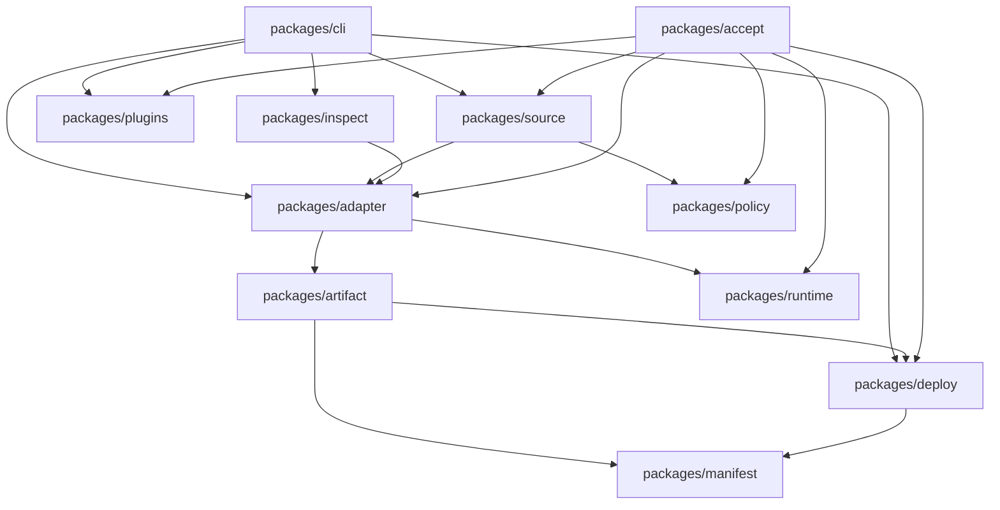
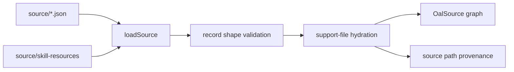
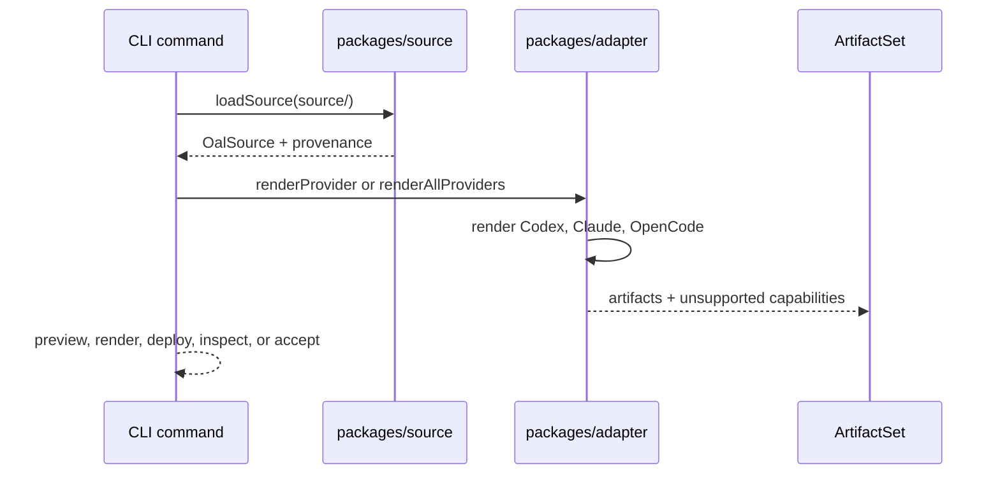
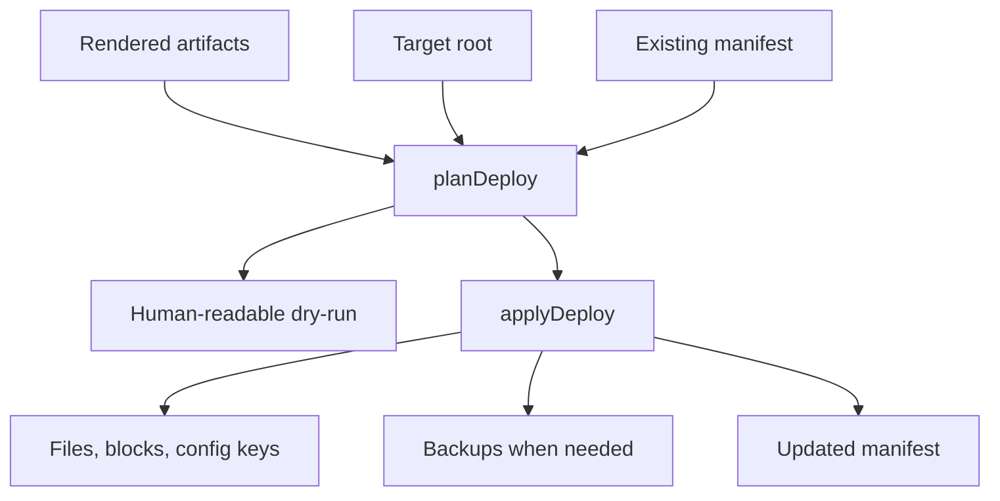
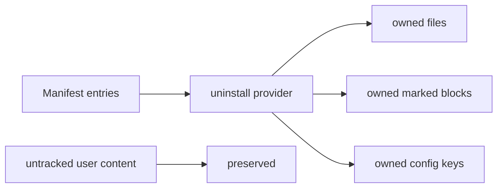

# Source, Render, Deploy Contract

OAL separates authored source, rendered artifacts, installed state, and manifest
ownership.

## Package Flow

The CLI is orchestration, not the source of product behavior. Source loading,
rendering, deployment, manifests, runtime hooks, plugins, inspection, and
acceptance each live in their owning package.

## Source Graph

`source/` records describe OAL intent:

- agents
- skills
- routes
- tools
- hooks
- product prompt contracts
- model plans

Source records must name supported providers. A renderer may emit only provider
surfaces that exist and are validated.

## Source Loading

`packages/source` reads JSON source records from `source/`, validates record
shape, hydrates skill support files, and returns the `OalSource` graph plus
provenance. Downstream packages should consume this loaded graph rather than
walking `source/` directly.

The source graph is the only supported input to renderers. Tests and acceptance
may inspect raw source files to verify inventory, but production rendering must
use `loadSource`.

## Rendering

Renderers convert OAL intent into provider-native files:

- Codex TOML, `AGENTS.md`, skills, hooks, runtime files
- Claude settings JSON, agents, commands, skills, hooks, `CLAUDE.md`
- OpenCode JSONC, agents, commands, tools, plugin files, instructions, hooks

Generated output must include provenance that connects artifacts back to source
records.

Each rendered artifact carries:

- provider
- path
- content
- source id
- mode, such as file, block, or config

`packages/artifact` owns artifact hashing, provenance markers, and drift
comparison. Renderers should return artifact objects, not write files.

## Deploy

Deploy must plan writes before applying, preserve user-owned content, merge
structured config where possible, write manifest ownership records, and support
dry-run output for review.

Deploy is intentionally two-phase:

1. `planDeploy` compares desired artifacts with the target root
2. `applyDeploy` writes planned changes

Plans carry change type, path, reason, backup behavior, and ownership metadata.
Apply should not rediscover intent; it should execute the plan.

## Uninstall

Uninstall must act only on manifest-owned material:

- files owned by OAL
- marked blocks owned by OAL
- structured config keys owned by OAL

User-owned files and config keys stay in place.

Uninstall reads the manifest first. It should not infer ownership from filenames
or provider directories. A matching OAL-looking path without manifest ownership
is user-owned for uninstall purposes.

## Inspect

`oal inspect` is the shared introspection surface for capabilities, manifests,
generated inputs, RTK guidance, command policy guidance, and release witness
data.

Provider-native tools and MCP servers should call this shared surface instead of
duplicating inspection logic.

`packages/inspect` depends on the same source and render paths as preview and
acceptance. If an inspect report disagrees with a renderer, fix the shared
renderer or artifact metadata rather than adding one-off inspect behavior.
