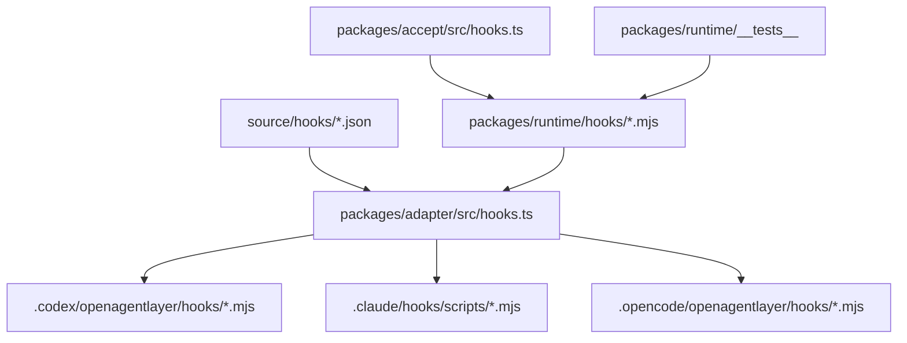
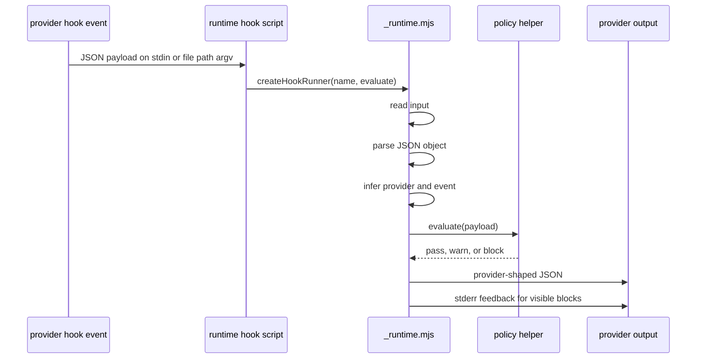
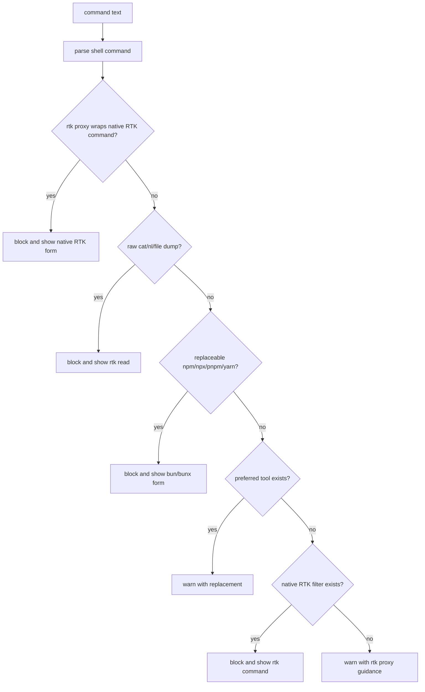

# Runtime Hooks and Message Style

Hooks are executable runtime behavior. They are not prompt suggestions, advisory
documentation, or provider-neutral strings.

## Runtime Ownership

`packages/runtime` owns hook scripts and shared hook policy helpers.
`packages/adapter` copies those scripts into provider-native directories.
`packages/accept` and runtime tests execute fixture payloads against them.



A hook exists only when all of these are true:

1. a source hook record owns the hook id, script, providers, and event map
2. a runtime `.mjs` script exists
3. provider renderers emit the script into provider-owned paths
4. provider config or plugin files wire the event where the provider requires it
5. acceptance or runtime tests execute representative payloads

## Hook Record Contract

Hook records MUST define:

- `id`
- `script`
- `providers`
- `events`

The `script` MUST be a file under `packages/runtime/hooks`. Scripts beginning
with `_` are support modules and MUST be rendered with hook artifacts when
runtime scripts import them.

## Shared Runner Contract

Most hooks MUST use `createHookRunner` from `_runtime.mjs`.



`createHookRunner` MUST:

- read stdin when no input path argument is provided
- read a path argument when provided and not `-`
- parse empty input as an empty object
- block malformed JSON
- require evaluator decisions to be `pass`, `warn`, or `block`
- infer hook event from `hook_event_name`, `hookEventName`, or
  `OAL_HOOK_EVENT`
- infer provider from `provider`, `hook_provider`, `OAL_HOOK_PROVIDER`, or
  Codex default
- format provider-specific output
- emit raw outcome only when `OAL_HOOK_RAW_OUTCOME=1`

## Provider Output Contract

| Decision | Codex PreToolUse              | Codex Stop/SubagentStop             | Codex other events             | Claude PreToolUse             | Claude Stop/SubagentStop | Claude other events |
| -------- | ----------------------------- | ----------------------------------- | ------------------------------ | ----------------------------- | ------------------------ | ------------------- |
| `pass`   | no output                     | no output                           | no output                      | no output                     | no output                | no output           |
| `warn`   | usually no output             | usually no output                   | session context when supported | additional context            | additional context       | additional context  |
| `block`  | `permissionDecision = "deny"` | `continue = false` with stop reason | system message                 | `permissionDecision = "deny"` | `decision = "block"`     | additional context  |

OpenCode hook behavior is mediated by rendered OpenCode plugin/runtime files.
OpenCode receives its provider-native plugin/runtime shape. Shared envelopes are
used only where the provider surface explicitly matches.

## Command Policy

Command policy is the runtime rule set that keeps AI command output bounded and
efficient.



`enforce-rtk-commands` MUST:

- extract command text from provider payload fields
- pass when command text is absent
- verify RTK is installed by checking `rtk gain`
- verify an RTK policy file exists globally or in the project
- apply Bun rewrites
- apply RTK-native command rules
- block native RTK commands wrapped in `rtk proxy`
- block raw file dumps that should use `rtk read`
- return actionable `Use:` guidance when a replacement is known

`advise-command-tools` MUST:

- warn on recursive `grep -R`
- warn on unbounded `find .`
- warn on regex editing of JSON, YAML, or YML through `sed` or `perl`
- pass bounded or tracked-file inventory commands such as `git ls-files` and
  `rg --files`

## Hook Inventory

Hook categories are:

- RTK command enforcement
- command-tool advice
- destructive command safety
- unsafe git operation safety
- protected branch safety
- secret file and secret output guards
- generated artifact edit and drift guards
- source evidence and validation evidence gates
- route contract and completion evidence gates
- `STATUS BLOCKED` evidence quality guard
- explanation-only result guard
- package script, project memory, git context, route context, changed-file, and
  subagent context injection
- repeated symptom circuit checks
- large diff warnings
- demo artifact, sentinel marker, and caveman filler guards

Adding a hook MUST update:

1. source hook record
2. runtime script
3. renderer path expectations when needed
4. provider wiring fixtures when needed
5. runtime or acceptance tests
6. specs when semantics add a new category or provider behavior

## Affirmative Message Style

All errors, warnings, notes, fix-its, hook feedback, and normal CLI status text
MUST follow a compiler-like style:

- no terminal period
- quote concrete values with backticks
- in template literals, wrap substituted values as `` `${value}` ``
- name the violated contract or expected command
- include a fix-it when the next command is known
- keep model-facing output affirmative, reward-shaped, and action-oriented
- lead with the valid behavior or supported path
- phrase boundaries as "use this path" with the valid next action first

Examples:

```text
RTK supports this command; run the RTK form
Use: rtk grep -n "pattern" source packages
Provider value `other` needs `codex`, `claude`, `opencode`, or `all`
```

Style tests should use short fixture strings that demonstrate the expected
shape, such as `Use the supported provider value`, without making that fixture
the recommended runtime copy.

## Secret and Safety Output

Secret checks MUST identify the rule and specific safe label without exposing
secret material. If a secret-like match comes from a false positive, the message
MUST keep the sensitive value out of output.

Generated drift and destructive command messages MUST state the protected
contract and the allowed next action. Model-facing wording stays neutral and
focused on the next valid action.

## Fixture Requirements

Hook fixtures MUST cover:

- pass, warn, and block decisions where the hook can produce them
- malformed input
- provider-specific output shape
- PreToolUse and Stop/PostToolUse behavior where applicable
- representative command payload fields
- stderr feedback for visible blocks

Acceptance MAY call runtime scripts directly with fixture JSON. Provider E2E
checks MAY supplement deterministic fixtures.
