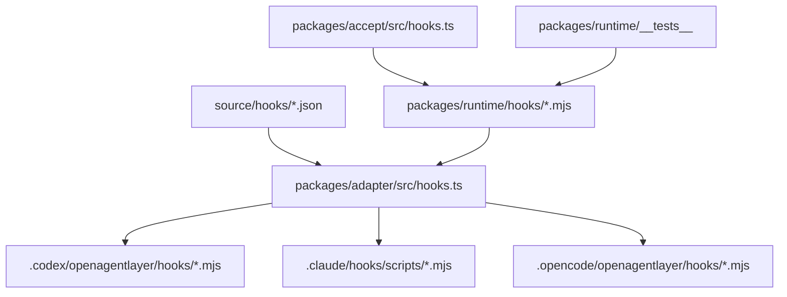
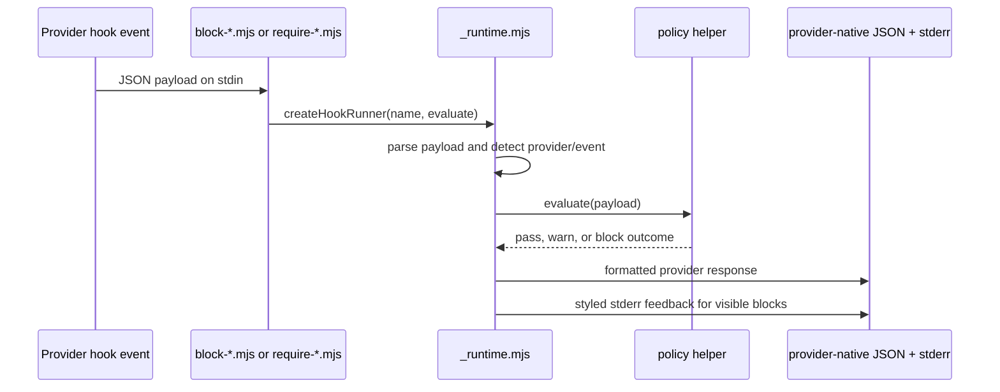
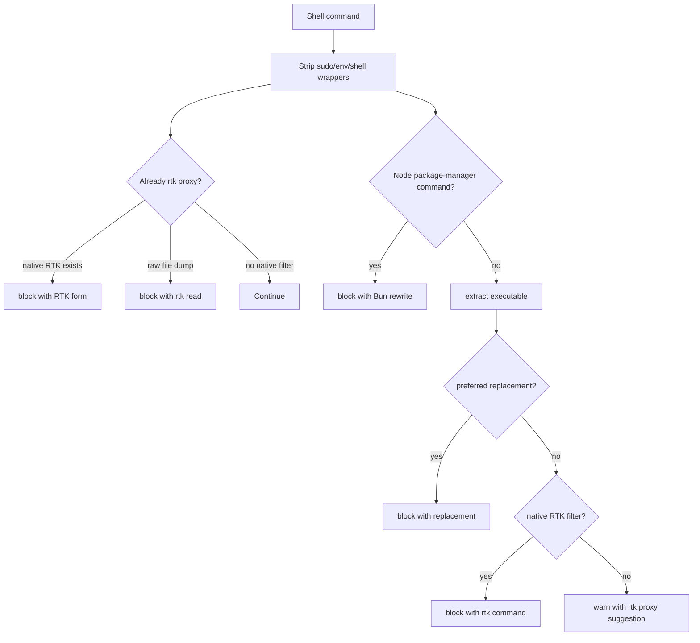

# Runtime Hooks and Message Style

Hooks are executable runtime behavior. They are not prompt suggestions.

## Runtime Package Shape

`packages/runtime` owns the hook scripts that render into provider targets. The
adapter packages copy these scripts into provider-native hook directories, and
acceptance executes fixture payloads against them.



## Hook Contract

Every OAL hook must:

1. be an executable `.mjs` runtime file
2. parse provider payloads defensively
3. return provider-native pass, warn, or block output
4. have fixture coverage in acceptance or runtime tests
5. keep model-facing output actionable

## Shared Runner

Most hooks use `_runtime.mjs`. Provider hook scripts should keep the entry file
small and place policy logic in a shared helper when multiple hooks need the same
behavior.



`_runtime.mjs` normalizes:

- empty or malformed input
- `hook_event_name`, `hookEventName`, and `OAL_HOOK_EVENT`
- `provider`, `hook_provider`, and `OAL_HOOK_PROVIDER`
- Codex versus Claude output envelopes
- colored stderr feedback when color is enabled

## Provider Outputs

Codex and Claude both receive JSON, but the shape differs:

| Decision | Codex PreToolUse              | Codex Stop/PostToolUse            | Claude PreToolUse             | Claude Stop/PostToolUse               |
| -------- | ----------------------------- | --------------------------------- | ----------------------------- | ------------------------------------- |
| pass     | no output                     | no output                         | no output                     | no output                             |
| warn     | usually no output             | session context when supported    | `additionalContext`           | `additionalContext`                   |
| block    | `permissionDecision = "deny"` | `continue`, `stopReason`, context | `permissionDecision = "deny"` | block decision or `additionalContext` |

OpenCode hook behavior is mediated through the generated OpenCode plugin and
runtime hook files. OpenCode receives plugin event behavior, not a copied Codex
or Claude hook shape.

## Command Policy

RTK-supported shell commands should route through native `rtk` filters. Use
`rtk proxy -- <command>` only when the command lacks a native RTK filter or
native output is not useful.

The command policy must distinguish native RTK filters, bounded file reads, Bun
package-manager rewrites, preferred quality-of-life tools, and noisy commands
that should use `rtk proxy`.



Command-policy output is intentionally direct because AI models see it in hook
feedback. The output names the route and shows the valid command when OAL can
derive it.

## Hook Inventory

Current hook categories:

- command routing and RTK enforcement
- destructive command safety
- secret file and secret output guards
- generated artifact drift guards
- route and completion contract checks
- source and validation evidence checks
- project, git, route, package-script, and memory context injection
- repeated failure circuit checks
- large diff warnings
- sentinel/demo/caveman output guards

Adding a hook requires source record ownership, rendered provider paths,
executable runtime files, and fixture coverage.

## Message Style

All errors, warnings, notes, fix-its, hook feedback, and normal CLI status text
must follow a compiler-like style:

- no terminal period
- quote concrete values with backticks
- in template literals, wrap substituted values as `` `${value}` ``
- name the violated contract or expected command
- include a fix-it when the next command is known
- keep hook output affirmative and action-oriented for AI models

Examples:

```text
RTK supports this command; run the RTK form
Use: rtk grep -n "pattern" source packages
Unsupported provider `other`; expected `codex`, `claude`, `opencode`, or `all`
```

Avoid model-facing phrasing that dwells on failure or blame. Prefer the contract
and the next valid action.
