# Architecture Under the Hood

This specification defines OAL's internal architecture. It exists to remove
ambiguity for agents changing code across packages.

## Architectural Principle

OAL is a compiler-style system:

1. load source records
2. validate policy
3. render provider artifacts
4. plan installation
5. apply installation
6. record ownership
7. expose inspection
8. validate product behavior

The architecture MUST preserve package ownership for each step.

## System Layers

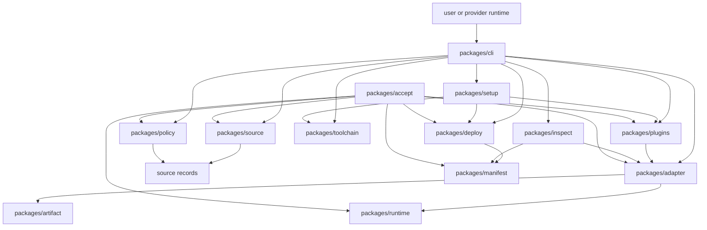

Dependency direction MUST follow product flow. Lower-level packages expose APIs
the CLI can call. Runtime hook scripts MUST remain executable with runtime-safe
JavaScript dependencies.

## Data Model

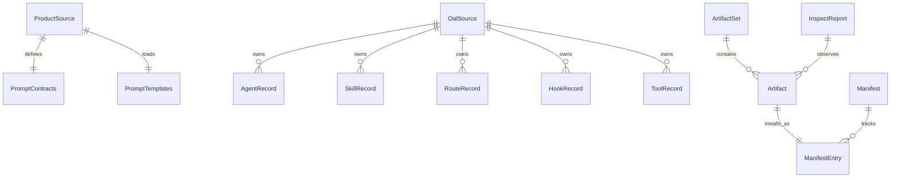

Source records, artifacts, and manifest entries stay distinct:

- source records answer what OAL should produce
- artifacts answer which bytes and paths were rendered
- manifest entries answer which installed material OAL owns

## Command Topology

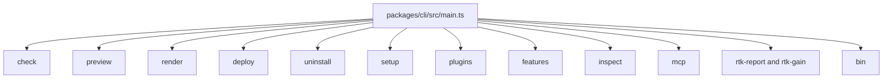

CLI command responsibilities are fixed:

- `check` loads source, validates policy, and proves provider renderability
- `preview` renders artifacts and prints selected paths or content without
  writing to targets
- `render` writes generated artifacts to an output directory
- `deploy` runs deploy planning and optional apply against project or global
  targets
- `uninstall` acts only on manifest-owned material for a provider
- `setup` orchestrates provider checks, optional toolchain setup, deploy,
  plugin sync, binary shim, and installed-state validation
- `plugins` syncs provider plugin payloads and keeps OAL-owned caches current
- `features` installs optional feature surfaces where applicable
- `inspect` calls `packages/inspect`
- `mcp` serves or configures OAL-owned MCP servers
- `bin` installs the source-checkout `oal` shim

Commands MUST reuse package APIs. Command handlers MAY format output, parse
arguments, and choose target paths.

## Source and Policy Architecture

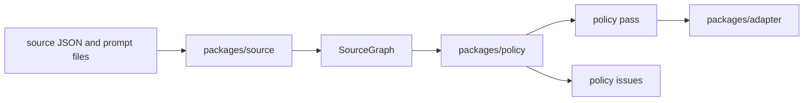

Policy validation MUST run before release-grade rendering and acceptance.
Policy checks SHOULD identify provider values, model choices, route and skill
references, generated prompt quality, hook shape, and support-file content that
need a supported source path.

## Renderer Architecture

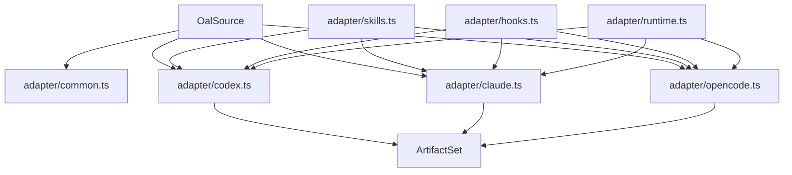

Shared adapter helpers MAY own prompt contract formatting, skill rendering where
provider skill layout matches, hook artifact copying, privileged runtime
artifacts, and common artifact creation.

Provider renderers MUST own provider config schema and serialization, provider
agent file format, provider command or route format, provider instruction file
format, provider plugin entrypoint expectations, and provider-specific
capability-boundary decisions.

## Deploy Architecture

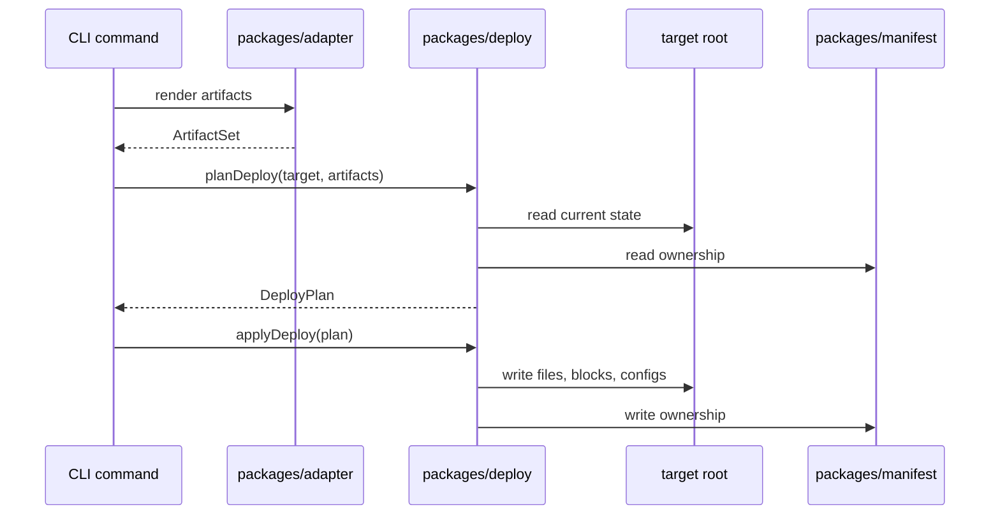

`DeployPlan` is the mutation boundary. Anything needed to explain, dry-run, or
apply a deploy MUST be present in the plan.

## Setup Architecture

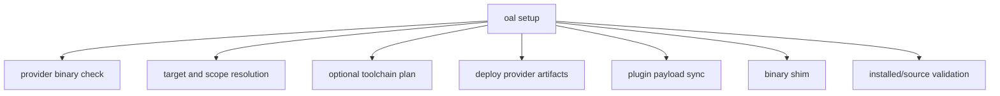

Setup MUST treat provider binaries as optional for planning. Missing provider
binaries SHOULD skip provider-native actions that require the binary while still
allowing source rendering, deploy, plugin payload writes, and validation that do
not require that binary.

Toolchain setup MUST use the Bun installer from `bun.sh`. Homebrew setup MUST
NOT try to install a nonexistent `bun` formula.

## Plugin Architecture

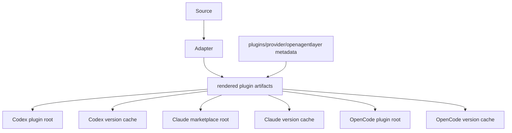

Plugin sync MUST copy static plugin metadata, render provider artifacts through
provider renderers, include plugin-suitable artifacts, write versioned cache
entries, keep OAL-owned cache versions current,
preserve unrelated user plugin material, and keep native provider activation
best-effort when the provider CLI is absent.

## MCP Architecture

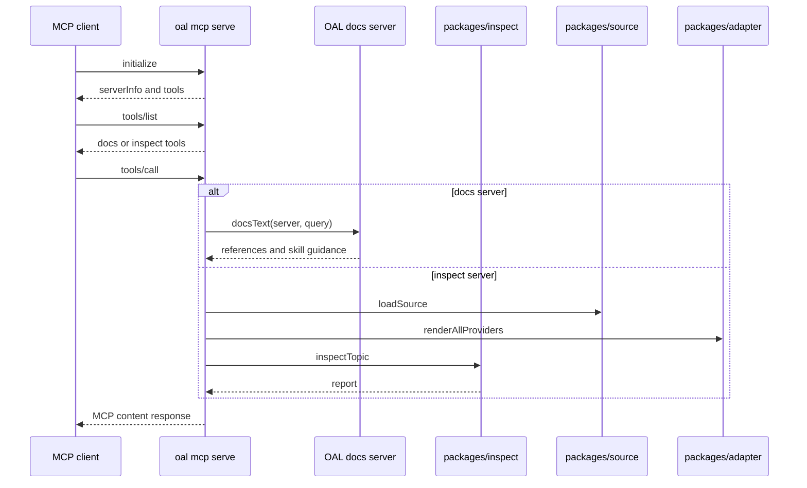

OAL-owned MCP servers are standard MCP servers served over stdio:

- `anthropic-docs`
- `opencode-docs`
- `oal-inspect`

Docs MCP servers return OAL-defined docs guidance and source references.
`oal-inspect` returns live OAL reports through shared source, render, and
inspect paths.

## Hook Architecture

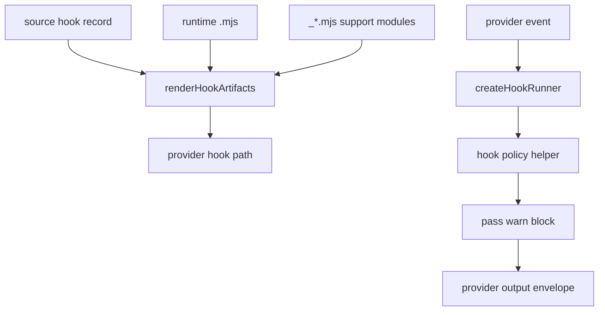

Hook policy helpers SHOULD be shared when multiple hook scripts evaluate the
same concept. Hook entry scripts SHOULD stay thin.

## Inspection Architecture

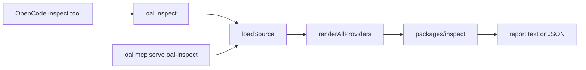

Inspection MUST be read-only. It MAY read manifests and generated source inputs
while keeping deploy targets and plugin caches unchanged.

## Acceptance Architecture

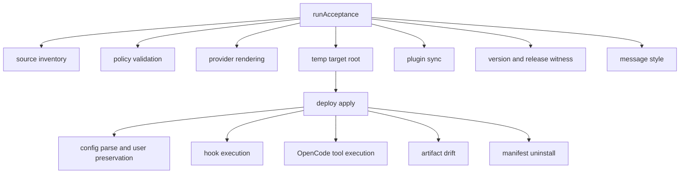

Acceptance is a product simulation. It MUST require cross-package behavior to
be substantial, connected, owned, and verified.

## Required Architecture States

The following states define the supported architecture:

- renderer behavior is implemented in source-owned packages and described in specs
- provider output has source record ownership or renderer-owned source ids
- hook source records point to existing runtime scripts
- runtime hook scripts are executable after deploy
- deploy mutates manifest-owned material
- uninstall uses manifest ownership
- plugin sync writes file payloads even when provider CLI activation is unavailable
- OpenCode tools call shared OAL inspect and command-policy surfaces
- MCP servers are exposed through `oal mcp serve` with acceptance coverage
- acceptance requires substantial generated artifacts
- docs/specs use current lower-case file names and live links

## Change Routing

| Change                            | Owning paths                                           | Required validation                              |
| --------------------------------- | ------------------------------------------------------ | ------------------------------------------------ |
| Source schema or record semantics | `packages/source`, `source/`, `packages/policy`        | source tests, `bun run check`, acceptance        |
| Provider file output              | `packages/adapter`                                     | adapter tests, config parse fixtures, acceptance |
| Hook policy                       | `packages/runtime/hooks`, `source/hooks`               | runtime hook tests, acceptance hook fixtures     |
| Deploy or uninstall               | `packages/deploy`, `packages/manifest`                 | deploy tests, uninstall fixture, acceptance      |
| Plugin sync                       | `packages/plugins`, `plugins/*`                        | plugin tests or acceptance plugin fixture        |
| MCP behavior                      | `packages/cli/src/commands/mcp.ts`, `packages/inspect` | CLI MCP tests, acceptance if product-wide        |
| Setup/toolchain                   | `packages/setup`, `packages/toolchain`, CLI setup path | setup tests, dry-run output checks               |
| Docs/specs only                   | `docs/`, `specs/`, link references                     | markdown/link grep, biome if configured          |
