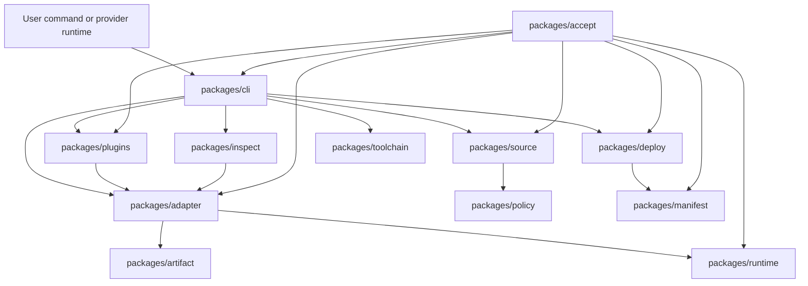
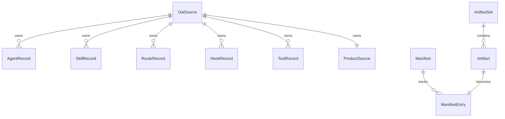
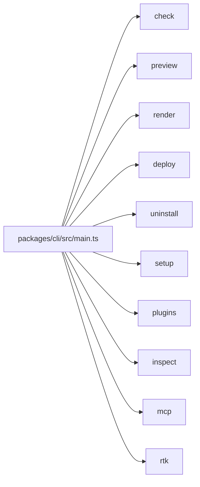
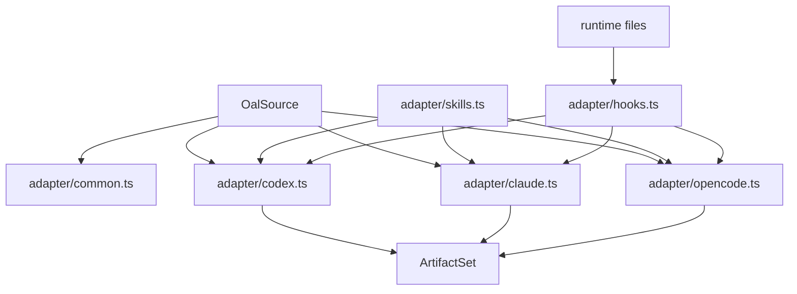
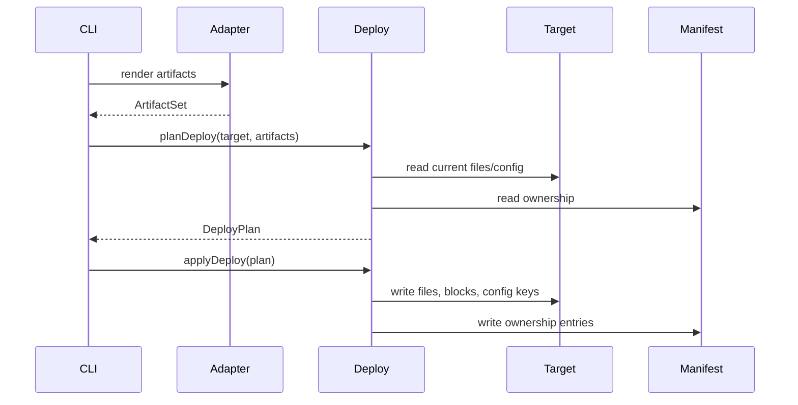
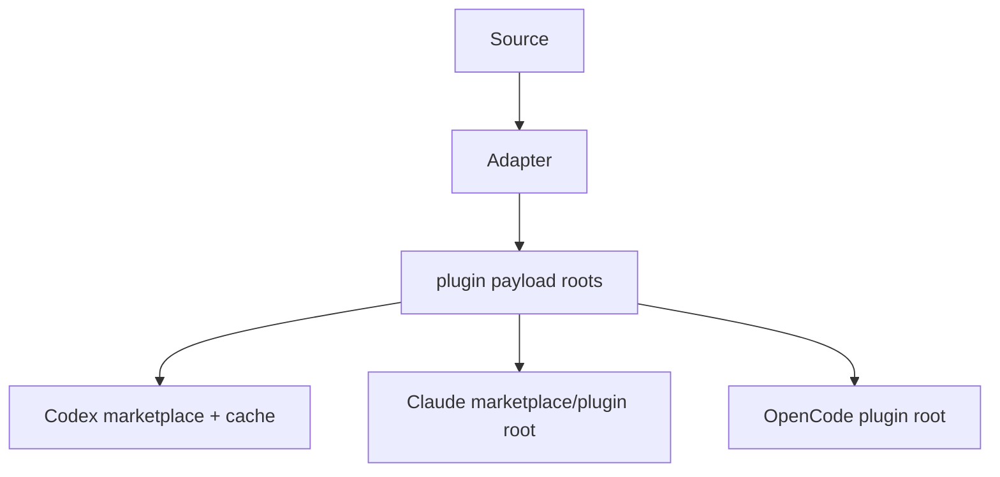
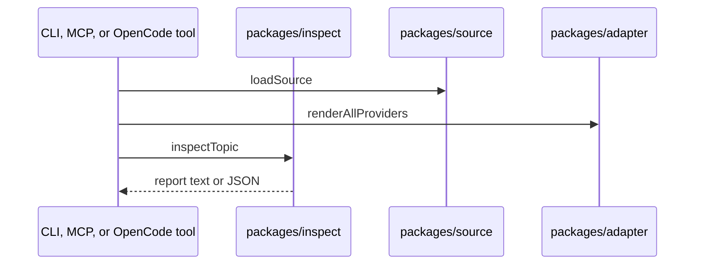
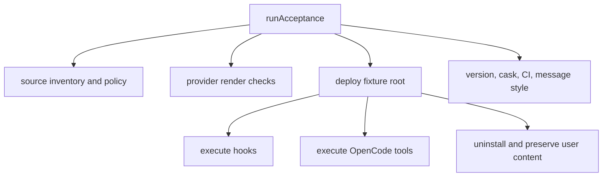

# Architecture Under the Hood

This file is the high-level map for AI coding agents changing OAL internals.
Use it before touching renderer, deployer, hook, MCP, plugin, or acceptance
behavior.

## System Layers

OAL is intentionally package-owned. Avoid moving behavior into the CLI because
that makes provider tools, MCP servers, acceptance, and setup drift from each
other.

## Data Model

Source records are intent. Artifacts are rendered output. Manifest entries are
installed ownership. These are separate types and should stay separate.

## CLI Commands

Important command ownership:

- `check` loads source, validates policy, and proves renderability
- `preview` renders and prints paths or contents
- `render` writes rendered artifacts to an output directory
- `deploy` writes into project or global targets through deploy plans
- `uninstall` acts from manifest ownership
- `setup` orchestrates toolchain, deploy, plugin sync, binary shim, and checks
- `plugins` syncs provider plugin payloads
- `inspect` returns shared reports from `packages/inspect`
- `mcp` serves OAL-owned MCP servers over stdio

## Renderer Architecture

Provider renderers should share helpers only when the provider behavior is truly
shared. If a provider has a different native surface, keep that difference in
the provider renderer and acceptance tests.

## Deploy Architecture

`DeployPlan` is the boundary between preview and mutation. Dry-run output should
come from the plan, and apply should execute the plan.

## Plugin Architecture

Provider plugin payloads are generated from the same artifacts and source
records as project deploys. Plugin sync writes provider-level payloads and prunes
stale OAL-owned caches.

Plugin activation is provider-native. Missing provider CLIs should not block
payload sync when OAL can still write owned payloads safely.

## Inspect and MCP

`oal inspect` and `oal mcp serve oal-inspect` are the same conceptual surface.
They load source, render artifacts, and ask `packages/inspect` for reports.

OpenCode custom tools should call `oal inspect` rather than duplicating report
logic.

## Acceptance Architecture

Acceptance is a product simulation. It is not a unit-test collection.

Acceptance should fail when a product surface is shallow, disconnected, or
unowned. Add acceptance coverage when changing behavior that crosses package
boundaries.
