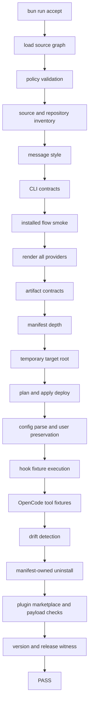

# Acceptance Contract

Acceptance proves OAL as a product. It combines tests, fixtures, manifests, and
green command output with direct evidence for the required behavior.

## Required Command

```bash
bun run accept
```

The command MUST pass in a clean fixture root without relying on the developer
home directory for mutable fixture state.

## Acceptance Flow



## Required Evidence

Acceptance MUST verify:

1. source records load through `packages/source`
2. source graph policy passes
3. source inventory uses current command aliases
4. authored Markdown style meets repository rules
5. repository inventory includes required packages and generated-surface owners
6. CLI help and expected command errors are clean
7. installed CLI smoke flow works in isolated roots
8. model allowlists keep rendered output on supported models
9. provider renderers produce substantial real artifacts
10. generated configs parse where possible
11. provider config schema contracts hold
12. hook source records point to runtime-owned scripts
13. hook scripts are executable
14. hook fixtures execute provider-shaped pass, warn, and block behavior where
    applicable
15. OpenCode custom tools execute and call shared surfaces where expected
16. skill support files render with expected content and executable mode
17. deploy preserves user-owned config and marked blocks
18. deploy creates backups where required
19. manifests track every rendered deploy artifact
20. fresh deploy drift detection reports no drift
21. edited deployed artifacts produce drift
22. uninstall acts only on manifest-owned material
23. user-owned config and blocks remain after uninstall
24. plugin payload sync writes current provider payloads
25. plugin payload sync keeps OAL-owned cache entries current
26. generated/source drift checks are active
27. docs and specs are connected active product paths
28. release version files agree
29. Homebrew cask syntax and release metadata are valid where applicable
30. CI workflow shape supports release gates
31. RTK gain fixtures prove threshold behavior without relying on live runner
    history
32. error, warning, note, fix-it, hook, and CLI status messages follow message
    style

## Artifact Threshold

Acceptance MUST require substantial provider output. Current acceptance requires
more than 100 rendered artifacts. Raising the threshold is allowed when OAL gains
durable product surfaces. Lowering the threshold requires source evidence that a
different guard now proves substantial output better.

## Fixture Root Contract

Acceptance MUST deploy into a temporary target root. The fixture MUST seed
representative user-owned provider files before deploy so preservation behavior
is actually tested.

Fixture paths MUST cover:

- Codex TOML config
- Claude JSON settings
- OpenCode JSONC config
- Markdown files with user content and OAL managed blocks
- executable hook targets
- provider plugin payload paths where product behavior depends on them

## Drift Contract

Acceptance MUST compare fresh deployed file artifacts against rendered artifacts.
Fresh deploy drift MUST be empty. After writing a manual edit to one comparable
artifact, drift MUST be non-empty.

This proves artifact hashing is connected to deployed bytes rather than merely
checking that a manifest exists.

## Manifest Contract

Acceptance MUST compare rendered artifact count and manifest entry count for the
deploy artifact set. A mismatch is a release blocker.

Acceptance MUST then uninstall each provider from the fixture root and verify
that file artifacts owned by OAL no longer exist while user-owned config and
blocks remain.

## Message Style Contract

Acceptance MUST scan code paths that emit normal textual output, hook feedback,
warnings, notes, fix-its, and errors. It MUST keep simple terminal-period
violations out of message-bearing strings and template literals where the
repository guard can detect them.

Message-style acceptance is a guardrail, not complete proof. Reviewers MUST
still inspect changed output strings for:

- meaningful contract names
- quoted concrete values
- affirmative model-facing wording
- actionable fix-its when the next action is known

## Test Style

Tests SHOULD assert behavior rather than implementation trivia. Strong evidence
includes:

- rendered artifact paths
- parsed config values
- manifest entries
- hook decisions and provider envelopes
- CLI exit codes
- concise message substrings
- release witness fields
- provider plugin payload paths

Tests SHOULD connect prose checks to behavior, rendered artifacts, or release
evidence.

## Completion Audit Requirement

Before marking broad OAL work complete, an agent MUST map each explicit user
requirement to concrete evidence:

- changed file or generated artifact
- command output
- test or acceptance fixture
- source record
- provider config parse result
- manifest entry
- hook fixture
- release witness

Passing `bun run accept` is required for release-grade work, but it is not a
substitute for checking that the specific user requirements were covered.
