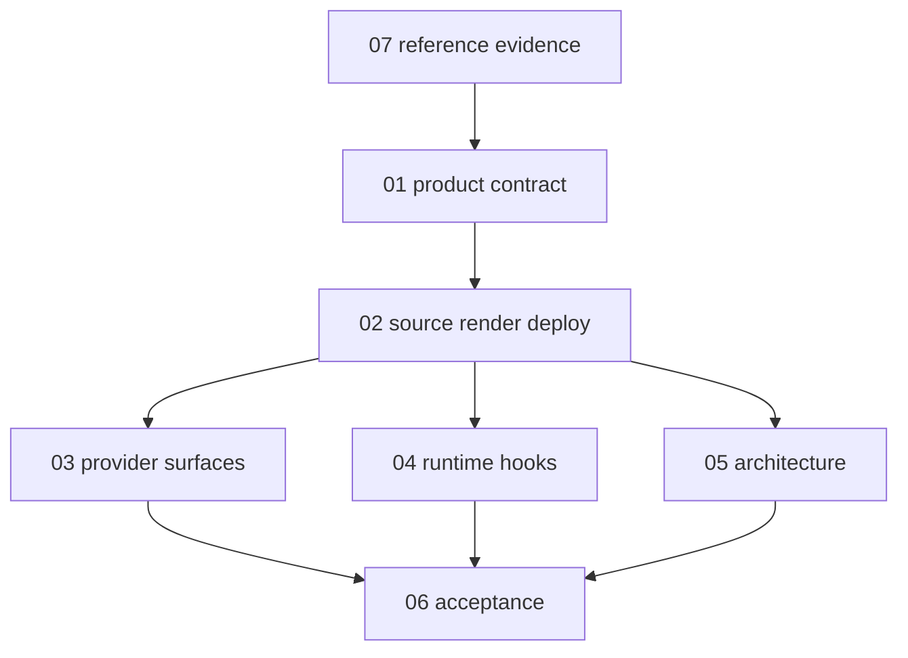

# OpenAgentLayer Specifications

This directory is the formal technical specification for OpenAgentLayer. It is
written for AI coding agents and maintainers who need to change OAL internals
without guessing at package ownership, provider behavior, hook semantics, or
release proof.

User-facing setup and workflow documentation lives in [docs/](../docs/).
Specifications describe required product behavior, internal boundaries,
rendered surfaces, algorithms, invariants, and acceptance evidence.

Read in this order:

1. [Product contract](01-product.md)
2. [Source, render, deploy contract](02-source-render-deploy.md)
3. [Provider surfaces](03-provider-surfaces.md)
4. [Runtime hooks and message style](04-runtime-hooks.md)
5. [Architecture under the hood](05-architecture.md)
6. [Acceptance contract](06-acceptance.md)
7. [Reference evidence](07-reference-evidence.md)

## Specification Language

The terms `MUST`, `SHOULD`, and `MAY` are normative.

- `MUST` defines required behavior for current OAL product code
- `SHOULD` defines the default unless source evidence requires another choice
- `MAY` defines optional behavior that still needs owner package and acceptance
  evidence before release

Specifications use affirmative framing. They state the desired architecture,
valid action, and rewardable behavior first. When a boundary is required, the
spec names the positive owner, supported path, or release gate instead of
centering the wording on prohibited behavior.

## Global Rules

Every specification in this directory follows these rules:

- authored source records in `source/` define OAL intent
- generated artifacts are disposable outputs
- provider renderers MUST emit provider-native files with explicit provider
  capability reports
- deploy and uninstall MUST use manifest ownership rather than path guessing
- hooks are runtime behavior and MUST be executable, fixture-tested, and
  provider-shaped
- docs and specs MUST describe current behavior, except explicit reference
  evidence that is labeled as historical input
- acceptance MUST prove product behavior that crosses package or provider
  boundaries

## Architecture Index

Use the most specific file when editing:

- product meaning, non-goals, release identity: `01-product.md`
- source records, renderer contracts, artifact metadata, deploy, uninstall:
  `02-source-render-deploy.md`
- Codex, Claude Code, OpenCode files and provider-specific behavior:
  `03-provider-surfaces.md`
- runtime hooks, command policy, hook output, message style:
  `04-runtime-hooks.md`
- package graph, dependency direction, CLI, plugin, MCP, acceptance topology:
  `05-architecture.md`
- release gates and fixture requirements: `06-acceptance.md`
- preserved research conclusions: `07-reference-evidence.md`
