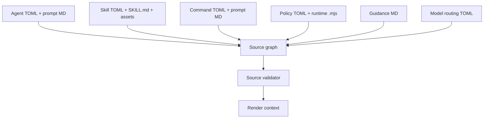
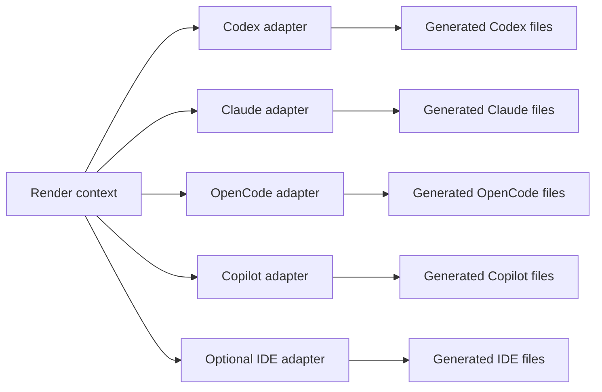
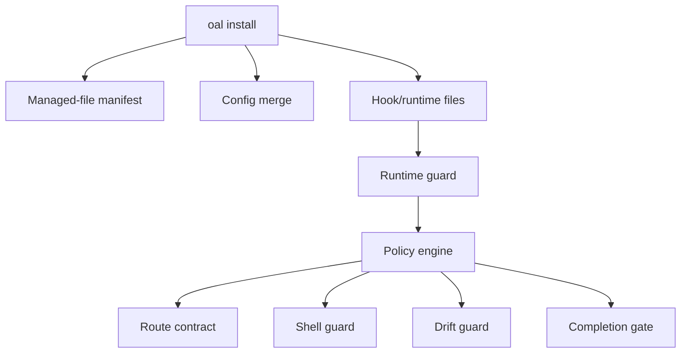

# OpenAgentLayer architecture graph

Purpose: v4 Mermaid graph source.

Authority: normative topology companion to `openagentlayer-v4.md`.

## Source graph

```mermaid
flowchart TD
  A[Agent TOML + prompt MD] --> G[Source graph]
  S[Skill TOML + SKILL.md + assets] --> G
  C[Command TOML + prompt MD] --> G
  P[Policy TOML + runtime .mjs] --> G
  D[Guidance MD] --> G
  M[Model routing TOML] --> G
  G --> V[Source validator]
  V --> R[Render context]
```

## Adapter graph

```mermaid
flowchart LR
  R[Render context] --> AC[Codex adapter]
  R --> AL[Claude adapter]
  R --> AO[OpenCode adapter]
  R --> AP[Copilot adapter]
  R --> AI[Optional IDE adapter]
  AC --> GC[Generated Codex files]
  AL --> GL[Generated Claude files]
  AO --> GO[Generated OpenCode files]
  AP --> GP[Generated Copilot files]
  AI --> GI[Generated IDE files]
```

## Runtime graph

```mermaid
flowchart TD
  I[oal install] --> MF[Managed-file manifest]
  I --> CF[Config merge]
  I --> HF[Hook/runtime files]
  HF --> HG[Runtime guard]
  HG --> PE[Policy engine]
  PE --> RC[Route contract]
  PE --> SG[Shell guard]
  PE --> DG[Drift guard]
  PE --> CG[Completion gate]
```

